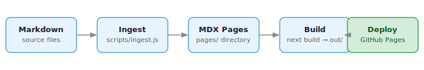

# nlp-mdsite

A Next.js static site template for intelligent, agent-friendly publishing from markdown.

Point it at a directory of markdown files, run a single command, and get a fully built
static website ready for GitHub Pages.

## Features

- **Markdown → MDX** — automatic conversion, any folder structure
- **Reading time** — estimated and injected into every page
- **Tags and categories** — rendered as pill chips, sidebar metrics
- **Theme toggle** — light / dark / system, one click
- **Per-page feed** — scroll to the bottom to continue reading the next page
- **Nav ordering** — configure page and folder order in `site.config.js`
- **GitHub Pages** — one workflow, zero manual steps

## Get Started

See [Getting Started](getting-started) to have a site running in minutes,
or browse the [Features](features) section for the full capability overview.
For background on the project and its roadmap, see [About](about).
