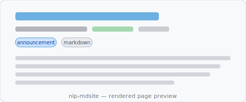

# Introducing nlp-mdsite

This site is built with nlp-mdsite — a static site template for publishing markdown
content with zero per-page configuration.

Everything you see on this page is driven by the frontmatter at the top of this
markdown file: the date, the "announcement" category chip, and the tags. Reading time
is estimated automatically from the word count and injected by the pipeline.

## How it works

Write your content as plain markdown. Run one command. Get a fully built static site.

The [content pipeline](/features/content-pipeline) handles the rest:
converting markdown to MDX, copying and path-rewriting images, generating navigation
metadata, and producing a post index.

## Source structure

This post lives at `docs/posts/2026/introducing-nlp-mdsite.md` in the repository.
The pipeline mirrors it to `pages/posts/2026/introducing-nlp-mdsite.mdx` and adds it
to `posts-index.json`, so it appears in the [Posts](/posts) index automatically.

The image above (`images/example.svg`) is stored next to this file at
`docs/posts/2026/images/example.svg`. The pipeline copies it to
`public/images/posts/2026/example.svg` and rewrites the reference to an absolute path.

## Next steps

- Read the [Getting Started](/getting-started) guide
- Browse the [Features](/features) section
- Fork the repo and point it at your own content
